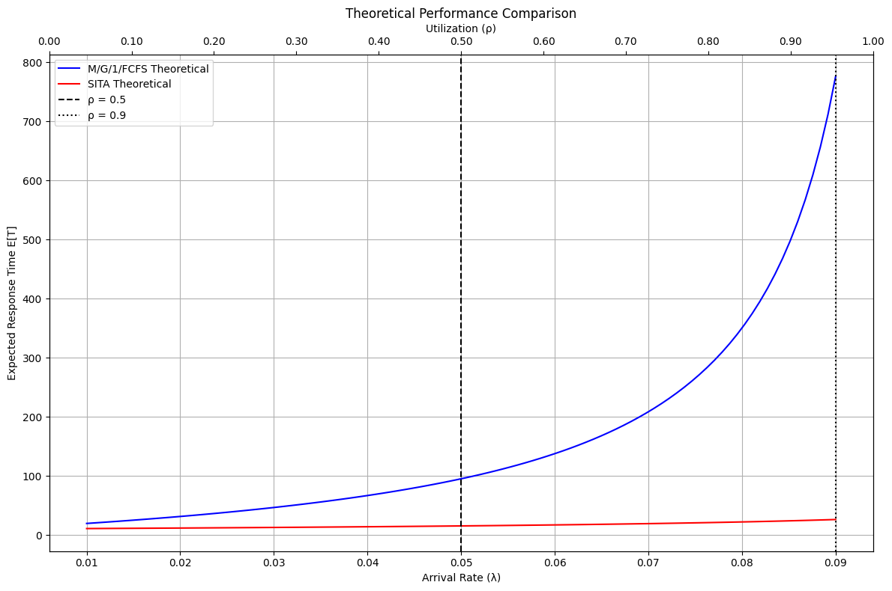
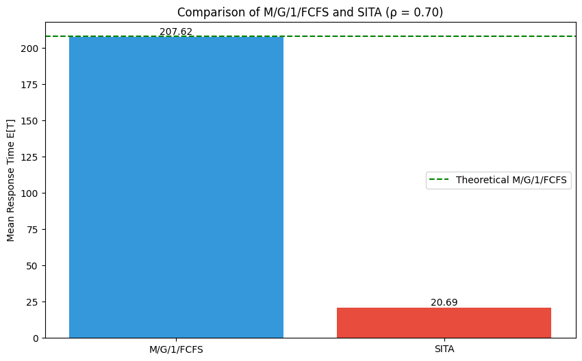
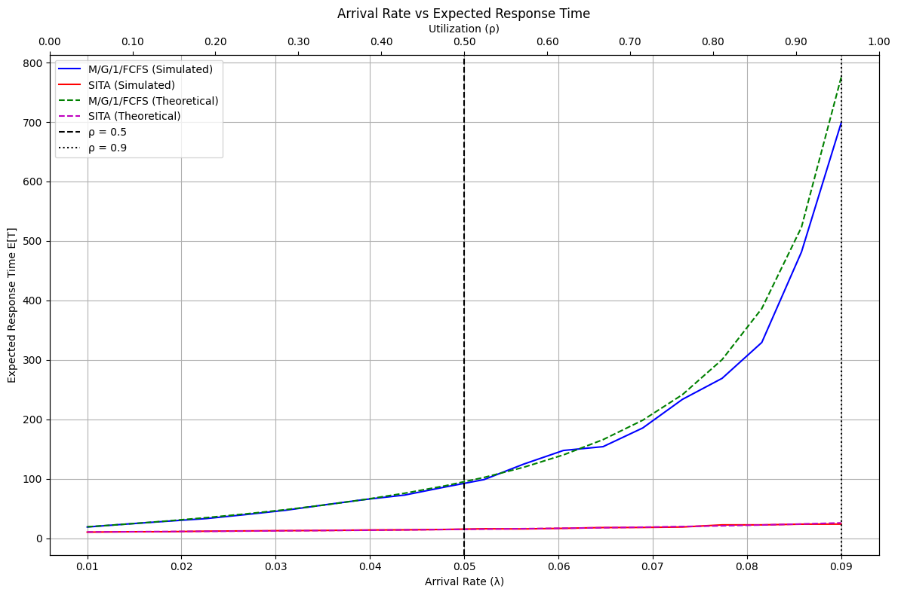
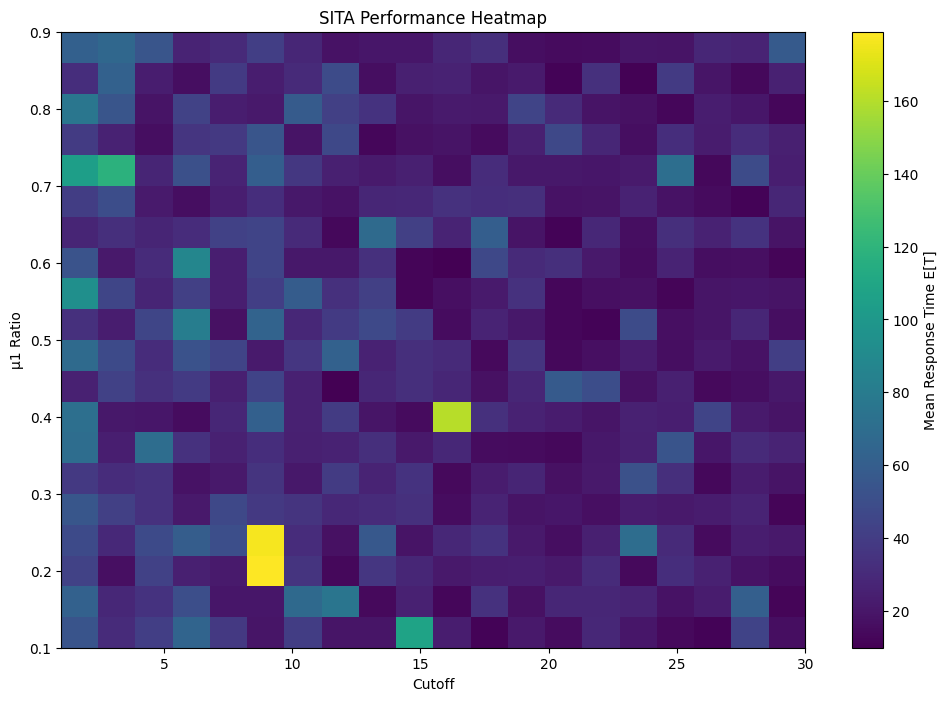
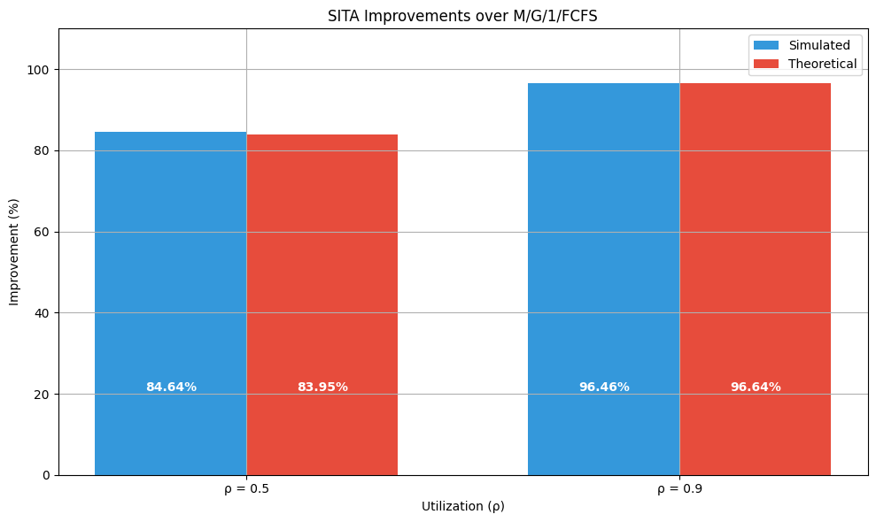

# Queue Simulator

This project implements a queue simulator to compare the performance of M/G/1/FCFS and SITA (Size Interval Task Assignment) queueing systems.

## Features

- Simulates M/G/1/FCFS and SITA queueing systems
- Compares theoretical and simulated performance
- Optimizes SITA parameters (μ1 ratio and cutoff)
- Visualizes results with various plots

## Key Components

- `QueueSimulator`: Main class for running simulations
- Plotting functions for visualizing results
- Optimization function for SITA parameters

## Usage

1. Set desired parameters in the control panel
2. Run the simulation
3. View generated plots and optimization results

## Results

### Theoretical Performance Comparison

### Experimental Expected Times Comparison

### Performance over Varying Arrival Rates

### SITA Performance Heatmap

### SITA Improvements

## Dependencies

- NumPy
- SciPy
- Matplotlib

## License

[MIT License](https://opensource.org/licenses/MIT)